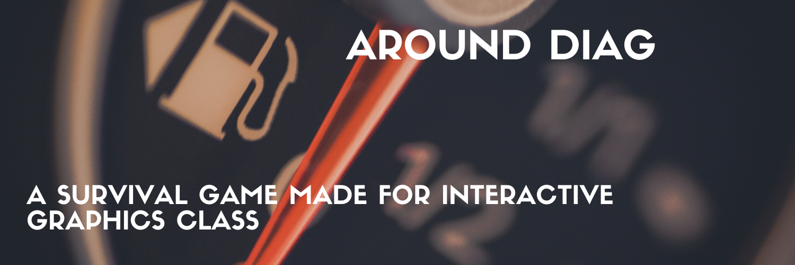

# AroundDIAG



AroundDIAG is a simple game where you run against time to collect fuels in order to survive. This project is designed and impelement for the solely purpose of Interactive Graphics course that is offered in Sapienza, University of Rome in 2020 by Prof. Marco Schaerf. 

### Running

Our project is live in this [link](https://sapienzainteractivegraphicscourse.github.io/final-project-successors/).

You can read the documentation [here](https://github.com/SapienzaInteractiveGraphicsCourse/final-project-successors/blob/master/documentation/report.pdf).

You can also start playing by cloning the repository and then just opening the index.html.
```sh
$ git clone https://github.com/SapienzaInteractiveGraphicsCourse/final-project-successors.git
```

### Components
- Buildings
- Trees
- Fuel
- House
- Cars
- Pole/Street light
- Traffic light
- Trash bins
- Roads
- Parking lot

### Features 
- Night/Day Cycle
- Rain/Snow 
- Car engine sound 
- Car horn sound 
- Back lights 
- Front lights with button
- Police Car lights


## Optimization
- fixed the FPS issue that was dropping too fast in game.
